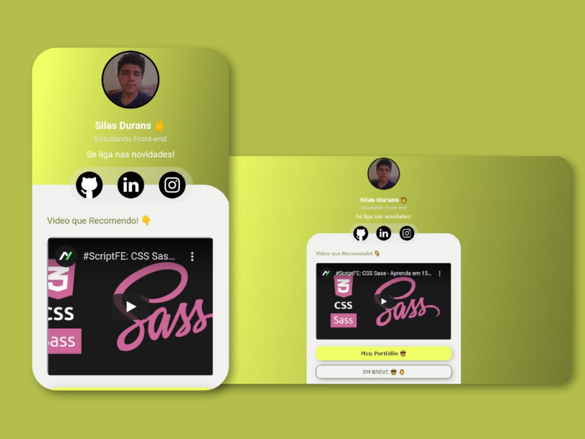

<h1 align="center">
  My Linktree
</h1>

  Projeto de Linktree , para links e informações ultéis.

  <a href="#sobre-o-projeto">Sobre o projeto</a> |
  <a href="#tecnologias">Tecnologias</a> |
  <a href="https://silasdurans.github.io/Linktree/">Link do Projeto</a>

<h2 id="sobre-o-projeto">Sobre o projeto</h2>

  O Projeto proposto no <em>Desafio CSS #2</em> é uma "Cópia" do Linktree , ou seja , uma página para você colocar seus links e informações ultéis.

<h2 id="tecnologias">Tecnologias</h2>

- HTML
- CSS